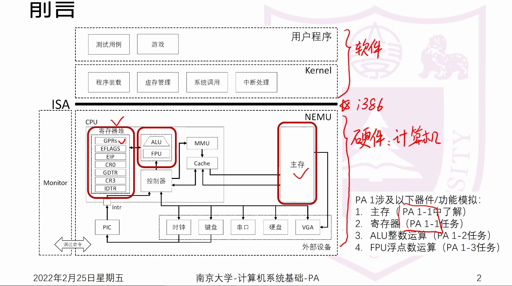
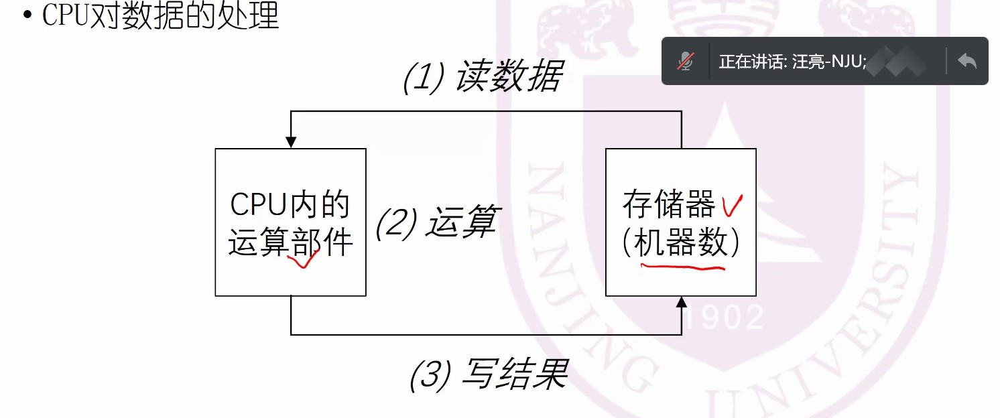
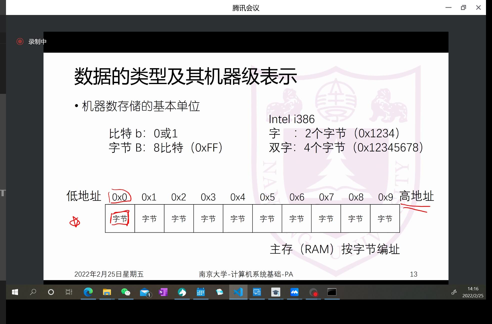
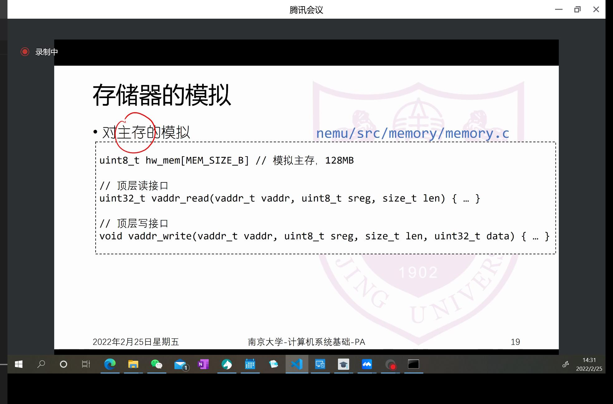
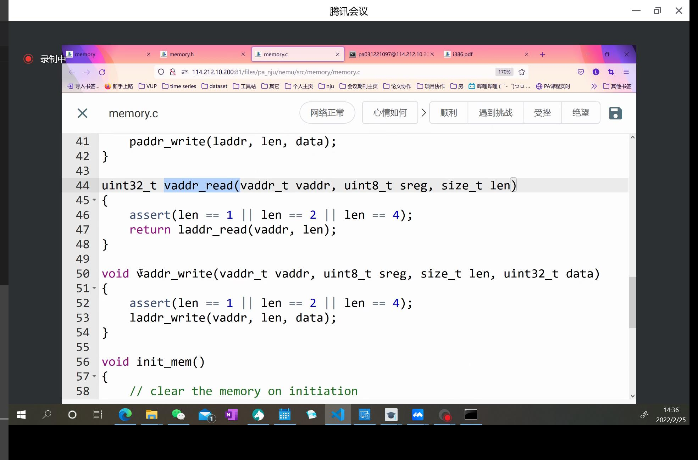
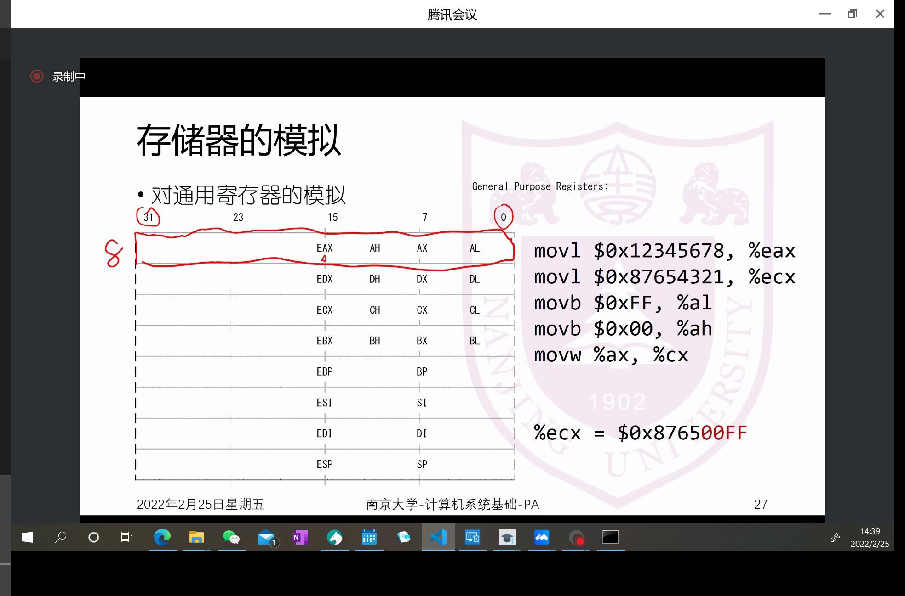
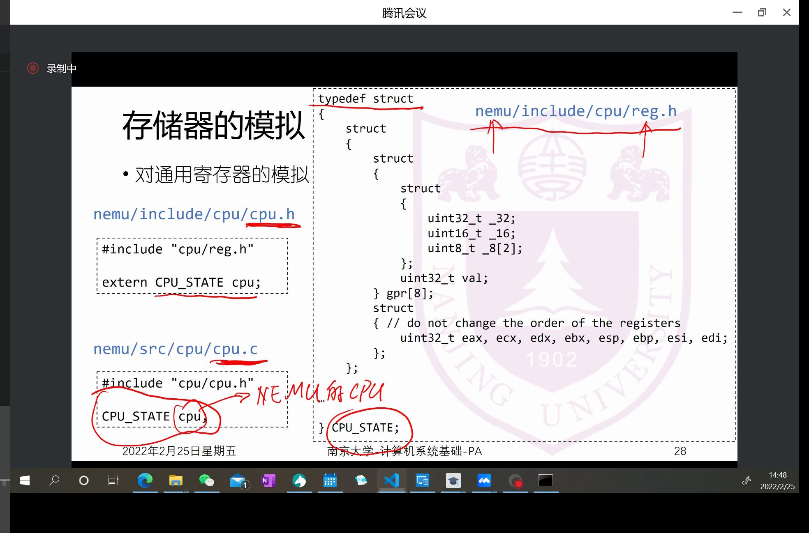
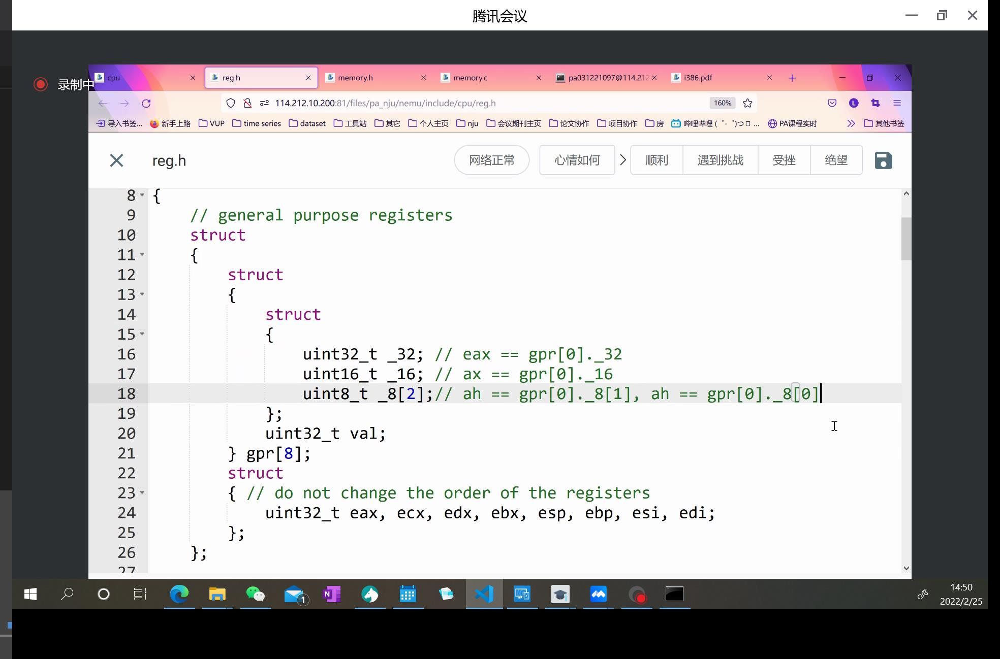
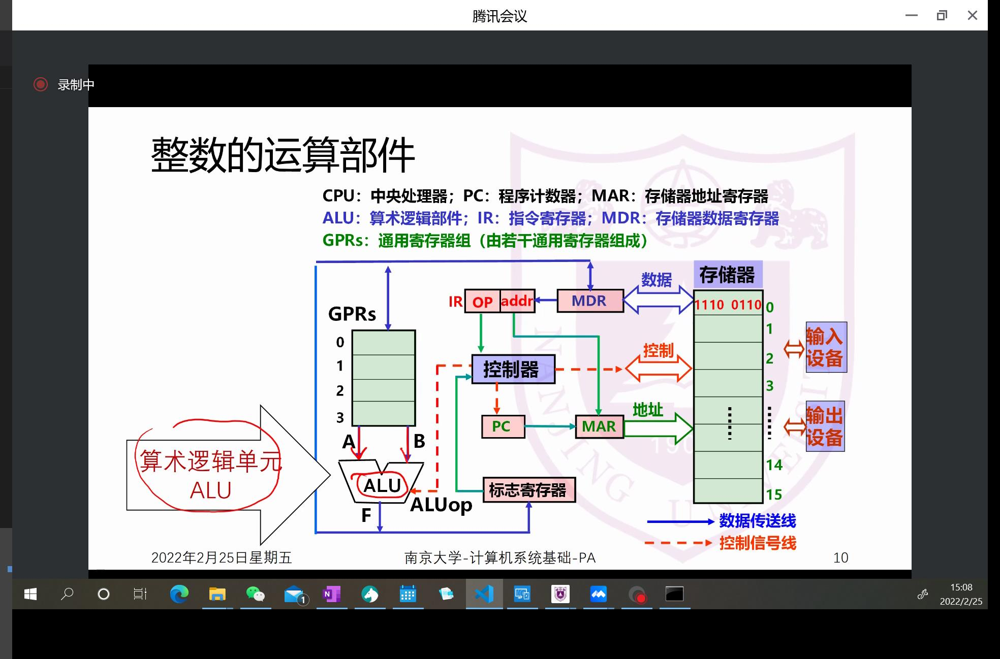
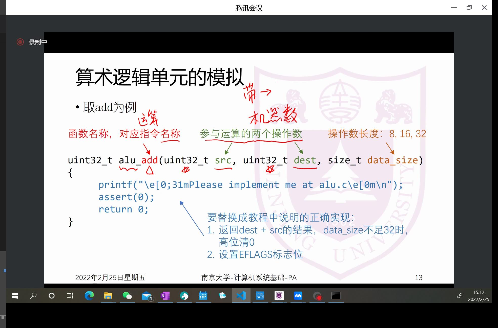

## PA1-1 数据的表示和存取

计算机：用以处理信息的设备。故第一步要解决数据、信息如何存取、表示。

PA1 典型数据存取

### 数据的类型及其机器级表示

数据（真值）的类型：
- 无符号整数
- 带符号整数
- 定点/浮点数
- 非数值型：字母、操作码等

机器数：二进制位串

编码过程：
- 无符号整数：直接编码，直接做进制转换即可
- 带符号整数：
  - 原码：直接编码+符号位（正0负1）
  - 补码：

### 机器数的存取

#### 机器数的定义

主存（RAM）：随机存取存储器

我们讲的大小以字节为单位

i386中定义：word（字）：2字节，double word（long，双字）：4字节，32位

i386：:3位机

随机存取：以O(1)的时间读写任意位置的数据

#### 大端方式和小端方式
问题：如果一个需要存取的数据超过了一个字节，怎么存：
例：0x 12 34 56 78

小端方式：低有效**字节**在低地址
- 0x3 : 0x12
- 0x2 : 0x34
- 0x1 : 0x56
- 0x0 : 0x78

大端方式：低有效**字节**在高地址

### 对于存储器的模拟
如何使用C语言模拟？

使用字节类型的数组进行模拟

#### 主存

内存访问接口：

**理解**主存的模拟方式

#### 通用寄存器
CPU内部的通用寄存器

寄存器最长：32位

整个A寄存器：EAX，低16位部分：AX，AX中的高8位：AH，低8位：AL。

make test_pa-1测试是否通过

## PA1-2 整数的表示与运算

### 整数的表示
- 无符号整数：
  - 关注最大位数以及最大表示区间
- 带符号整数：
  - 常用补码表示法
    - 优点：0表示唯一，可以用加法表示减法（模运算系统）

### 整数的运算

模拟ALU支持功能：
- 算数运算：加减乘除、移位
- 逻辑运算：与或非

c语言中的无符号类型表达的是机器数的意思

注意根据操作数长度确定无效位数长度，并在**输出时进行高位清零**

相加后还要操作相应flag

CF：无符号int的加减法，看是否需要进位或借位
OF：当做补码表示，看是否溢出

两者不同示例：

AF不模拟

看好sign_ext和sign函数的具体定义

sign_ext在后续会频繁使用

